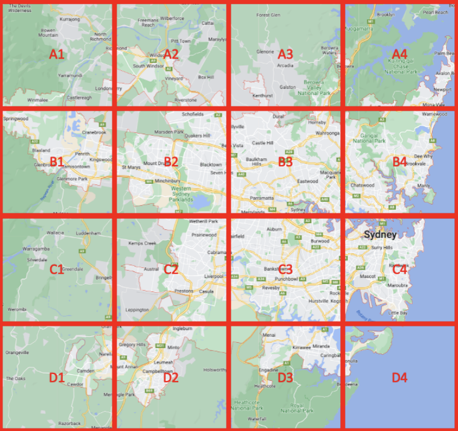

# Summary

This project implements a simple, parallelized application leveraging the University of Melbourne HPC facility SPARTAN. We analyses, using a large Twitter dataset and a grid/mesh `sydGrid.json` (shown below) for Sydney, to identify the insights on languages used in making Tweets.



Our application should be run once to search the `bigTwitter.json` file on each of the following resources:

- 1 node and 1 core;
- 1 node and 8 cores;
- 2 nodes and 8 cores (with 4 cores per node).

Return the final results and the time to run the job itself.

# Repo Structure

```
├── deprecated/                   # non-ideal approaches
|   ├──── intercomm/              # spawn dynamic inter-commuincator
|   |   ├────── count.py
|   |   └────── pergridcount.py
|   └──── setup/                  # setup as a root user
|       └────── setup.sh
├── output/                       # results
|   ├──── 1n1c.out
|   ├──── 1n8c.out
|   └──── 2n8c.out
├── scripts/
|   ├──── 1n1c.slurm              # 1 node 1 core
|   ├──── 1n8c.slurm              # 1 node 8 core
|   └──── 2n8c.slurm              # 2 node 8 cores
├── .gitattributes
├── .gitignore
├── LICENSE
├── README.md
├── count.py                      # main
├── utils.py
├── mesh.png
├── requirements.txt              # Python dependencies
└── run.sh                        # application entrypoint
|
├── largeTwitter.json             # linked
└── sydGrid.json                  #
```

# Run

In the root directory, invoke

```
export DATA_PATH=/data/projects/COMP90024   # example path
bash run.sh
```

to run application on each of the 3 resources. This will take a few minutes, later the results can be found in `/out`.
